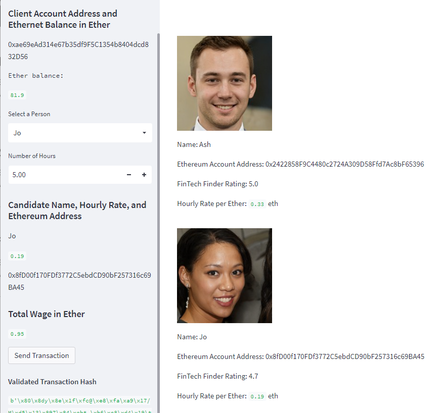
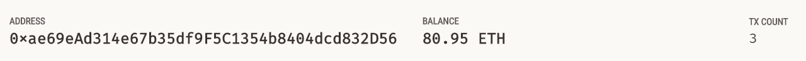
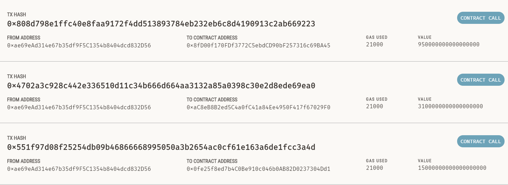

# Fintech Finder

App to find and hire fintech professionals and pay them in Ether.

## Technology

Built on python 3.7 using:

* [Streamlit](https://streamlit.io/) - for interactive web interface
* [Web3](https://web3py.readthedocs.io/en/stable/) - to transact on the Ethereum blockchain
* [Ganache](https://github.com/trufflesuite/ganache) - to run transactions on local Blockchain 

## Usage

Clone the github repository:

```git clone https://github.com/tnmercer/ethereum_blockchain.git```

Navigate to file using terminal and run:

```streamlit run fintech_finder.py```

Select fintech professional in sidebar and number of hours to hire.
Send transaction button to pay.

Note, this app requires a mnemonic code to generate an account. Connect to your .env file to run.

## Examples

App image:



Example image of Ganache test account: 



Example of transactions executed through this app:



## Contributors

[Toni Mercer](https://www.linkedin.com/in/toni-mercer/) with UW Fintech Bootcamp starter code
